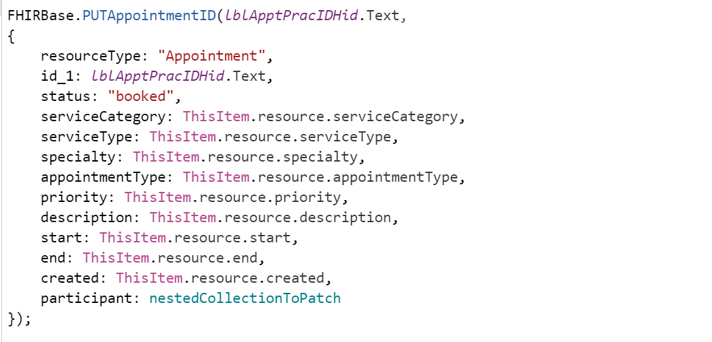

# Usecase for Clinician

## Home 
When you load the clinician app you will be presented with the main page. For this use case, a clinician will click on '**Book Appointment**' 

This button click will call _**ClearCollect()**_ function. This function clears whatever is in the variable (*colAppointments, colPatients, colPractitioners*)  and load fresh collections from the datasource

> ClearCollect(colAppointments, FHIRBase.GETAppointment().entry.resource);

> ClearCollect(colPatients, FHIRBase.GETPatient().entry.resource);

> ClearCollect(colPractioners, FHIRBase.GETPractitioner().entry.resource);

After retrieving the data the same button action ('_onSelect_') will navigate the app to screen called _scrAppointments_

> Navigate(scrAppointments);

## Appointment Screen
As you see below, the above function calls allow us to retrieve all the information shown below.

Clinician now is now going to response by clicking on one of the three icons (_Accept, Decline, Tentative_)

## Accept/Decline/Tentative
Once the clinician clicks on one of the three choices the app will make a call to our FHIR connector to update the status of the appointment. The app view will be updated with the new status.

 
We do this by calling an update function on the connector

> FHIRBase.PUTAppointmentID()

If you check the last line, there is a variable called '_nestedCollectionToPatch_'.  

We are using a '_**Patch()**_ function to retrieve nested Participant in our Appointment object. This will allow us to update the status of the Practitioner.

Once we update the status we put that collection in our PUT object as such: 

> participant: nestedCollectionToPatch

